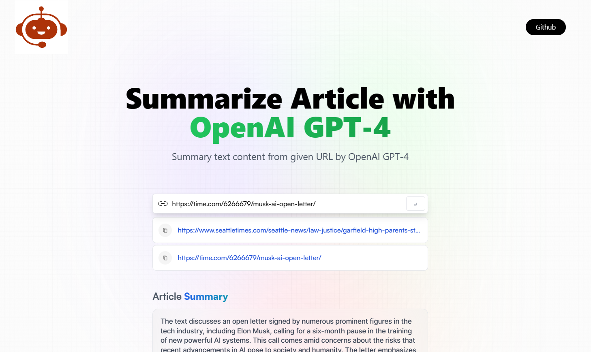

# Chat GPT Summarizer

Summary text content from given URL by using Summarizer API from Rapid API

https://rapidapi.com/restyler/api/article-extractor-and-summarizer

## Screenshots



## Environment Variables

To run this project, you will need to add the following environment variables to your .env file

`VITE_RAPID_API_ARTICLE_SUMMARY_KEY:RAPID_API_KEY`

## Features

- Light/dark mode toggle
- Live previews
- Fullscreen mode
- Cross platform

## Installation

Install my-project with npm

```bash
  npm install my-project
  cd my-project
```

## License

[MIT](https://choosealicense.com/licenses/mit/)
